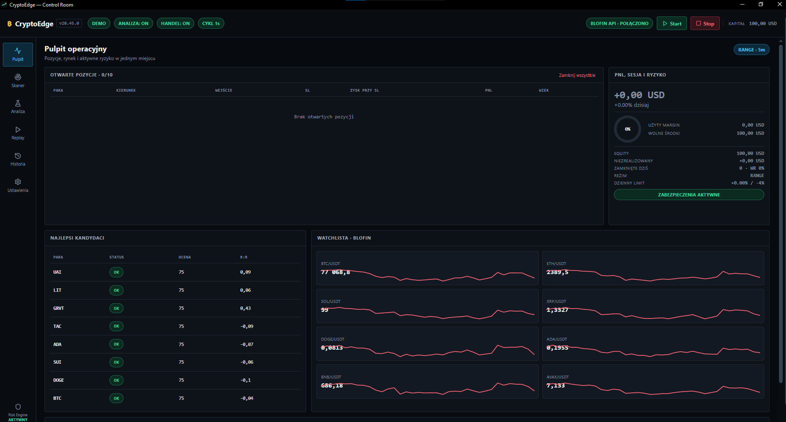

# CryptoEdge

**Paper-first research desk for crypto USDT-M perpetuals.**  
Python engine + native PySide6 UI. Live order placement stays **off** unless you explicitly enable it.

CryptoEdge is a personal quantitative trading workstation: multi-timeframe daytrading (V2), hard risk gates, purged walk-forward, and a modular monolith so strategy, risk, and execution stay testable in isolation.

Ready for **ChatGPT Codex**, **GitHub Copilot**, and **Claude Code** via [`AGENTS.md`](AGENTS.md).



Native DESK: open positions, candidates, BloFin watchlist, session PnL and risk. Screenshot is **PAPER/DEMO** with an empty book — filled positions wait on modular migration ([ROADMAP](ROADMAP.md) M0).

> Not financial advice. Defaults to **PAPER**. API keys never belong in git (`.env` is gitignored).

## Why this repo exists

Most crypto “bots” mix signals, sizing, and exchange I/O in one loop. This project is the opposite:

- **Strategy** sees a market snapshot, not your wallet or LIVE flag
- **Risk** owns size, cluster caps, and vetoes
- **Execution** owns fills, SL/TP, reduce-only (paper adapter today)
- **Replay / walk-forward** reuse the same decision path as the desk

Architecture notes live in [`docs/architecture/`](docs/architecture/) (ADR-001 modular monolith, migration stages 0–7).

## Features

| Area | What you get |
|---|---|
| Engine V2 | 1H bias, 15m trigger, 5m veto, 4H context; major / alt / XAU profiles |
| Risk | Min 5% equity size floor, gross/cluster caps, loss-streak pause |
| Research | Purged walk-forward, historical replay, MAE/MFE, parity tests |
| Desk UI | DESK / SCAN / LAB / REPLAY / HISTORY / SET |
| Venue | BloFin USDT-M for paper/live path; Binance public WS as confirm |
| Agents | `AGENTS.md` + Copilot instructions for Codex / Claude / Copilot |

## Quick start

Python **3.10+**.

```bash
python -m venv .venv
source .venv/bin/activate   # Windows: .venv\Scripts\activate
pip install -r requirements.txt
cp .env.example .env        # optional keys; leave empty for paper
python app.py
```

Windows: `CryptoEdge.bat` or `URUCHOM.bat`.

1. **SET** — PAPER on, paste BloFin keys only if you need account reads  
2. **Analysis** — start the scan  
3. **Trading** — separate, confirmed control (not auto-armed)

```bash
python run_tests.py
python run_historical_replay.py --days 90 --symbols BTC ETH SOL --oos 0.30
```

### ChatGPT Codex

Open this repository in Codex (or `chatgpt.com` with GitHub connected). The agent reads [`AGENTS.md`](AGENTS.md) for boundaries: no secrets, paper-first, no strategy/exchange mixing.

```text
Task example: add a MarketDataPort adapter for Bybit klines; do not change V2 TP/SL.
```

## Repository layout

```
app.py / runtime.py     composition root
daytrading_engine_v2.py live strategy
cryptoedge/             domain, ports, adapters (modular split)
AGENTS.md               instructions for Codex / Claude Code / Copilot
docs/architecture/      ADR + migration plan
ROADMAP.md              milestones M0–M5
tests/                  gates, parity, rate-limit
walk_forward_v2.py      purged folds
```

## Status

| | |
|---|---|
| Version | **20.37.0** |
| Default | PAPER, `LIVE_EXECUTION_ENABLED=False` |
| License | MIT |
| Plan | [ROADMAP.md](ROADMAP.md) — modules → V2/replay freeze → VPS → Tauri hookup → strategy brain |

This is an active research codebase, not a hosted product. Issues and PRs that improve tests, docs, or adapters are welcome. Strategy “edge” claims belong in walk-forward reports, not marketing.

## Disclaimer

Trading perpetual futures can wipe a deposit. The author is not a broker. Run paper first. Rotate any key that ever touched a zip, chat, or screenshot.
